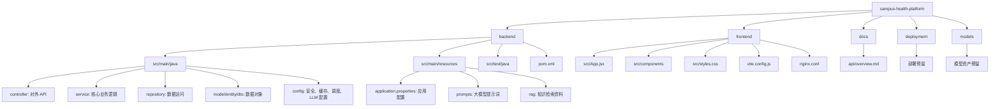

# Campus Health Platform

一个用 Java 和 Spring Boot 搭建的校园健康管理后端平台骨架，覆盖数据接入、模型推理、权限控制、审计追踪和健康风险评估。

## GitHub 简介
Campus Health Platform 是一个面向校园场景的健康管理平台示例，目标是把学生健康数据、风险评估、干预建议和审计追踪串成一条完整闭环。

它适合用来展示以下能力：
- 校园健康数据采集与汇总
- 基于规则的风险评估与分级
- 根据风险因子生成个性化健康管理方案
- 学生、教师、管理员三类角色的权限控制
- 审计日志、模型推理和持久化存储

## 文件结构图


## 文件功能
- `backend/`：后端核心，负责登录认证、学生和教师管理、健康数据录入、风险评估、个性化方案生成、审计日志和模型推理。
- `frontend/`：前端界面，负责学生端、教师端和管理端的页面展示、图表渲染和表单提交。
- `docs/`：接口和说明文档，方便快速查阅 API 和项目设计。
- `deployment/`：部署相关预留目录，后续可以放 CI/CD、容器编排或云部署脚本。
- `models/`：模型资产预留目录，后续可以放本地模型文件、配置或推理资源。

## 代码分层
- `controller`：接收 HTTP 请求，做输入输出转换。
- `service`：实现真正的业务规则，比如风险评估、权限判断、健康方案生成。
- `repository`：和数据库打交道，负责持久化和查询。
- `model`、`entity`、`dto`：承载不同层之间传递的数据。
- `config`：统一管理安全、缓存、调度和大模型接入相关设置。

## 产品视角
这套平台可以理解为“校园健康运营中台”：它把分散在学生自评、设备采集、教师干预和系统审计里的数据串起来，形成一条可追踪、可解释、可干预的健康管理闭环。

如果从业务角度看，它主要解决四类问题：
- 学生健康状态看不清，缺少统一入口查看趋势和风险。
- 健康数据来源分散，手工记录、问卷、设备采集难以汇总。
- 风险评估结果不好落地，只有分数，没有明确干预建议。
- 管理动作不可追踪，谁看了什么、谁改了什么、谁触发了什么流程不够清晰。

平台把这些问题拆成了“采集、评估、建议、追踪”四步，让学生、教师、管理员都能在同一套系统里完成自己的工作。

## 技术栈
- Java 17
- Spring Boot 3.2
- Maven
- Spring Web / Validation / Actuator / Spring Data JPA / PostgreSQL

## 目录
- `backend/`：Java 后端服务
- `docs/api/`：接口说明
- `frontend/`：前端预留目录
- `deployment/`：部署预留目录
- `models/`：模型资产预留目录

## 本地启动
如果你的网络环境可以正常拉取 Docker 镜像，可以直接使用 Docker Compose：

```bash
docker compose up --build
```

启动后访问：
- 前端可视化平台：`http://localhost:3000`
- 后端接口：`http://localhost:8080`

如果 Docker 镜像拉取受限，建议改用本地方式启动，项目默认可直接运行 H2：

```bash
cd backend
mvn spring-boot:run
```

```bash
cd frontend
npm run dev -- --host 0.0.0.0
```

本地调试时：
- 前端开发服务器：`http://localhost:5173`
- 后端接口：`http://localhost:8080`

如果你只想本地调试前端，在 `frontend` 目录执行：

```bash
npm install
npm run dev -- --host 0.0.0.0
```

生产构建：

```bash
npm run build
```

Vite 开发服务器已配置 `/api` 代理到 `http://localhost:8080`。

## 健康检查
- `GET http://localhost:8080/api/v1/health/ping`

## 认证方式
所有业务接口都需要请求头 `X-Api-Token`，健康检查除外。

可用示例 token：
- `token-student-s1001`
- `token-student-s1002`
- `token-staff-health`
- `token-admin-platform`

## 主要接口
- `GET /api/v1/students/{studentId}/summary`
- `GET /api/v1/students/{studentId}/signals`
- `POST /api/v1/students/{studentId}/signals`
- `POST /api/v1/assessments`
- `POST /api/v1/models/inference`
- `POST /api/v1/staff/students/{studentId}/password`
- `GET /api/v1/audit/events`

## 前端能力
- 独立学生登录页和管理登录页
- 学生端主页：个人画像、趋势图、风险指标和自助录入
- 管理台主页：学生检索、筛选、模型推理、运营概览和审计事件流
- 教师端支持为学生重置密码和统一管理学生账号
- BI 风格趋势图和条形风险图
- 模型推理与推荐动作展示
- 健康信号录入表单
- 管理员审计日志查看

## 说明
当前版本已经包含：
- 校园健康数据接入服务
- 规则驱动的模型推理接口
- 外部大模型接入开关、提示词模板、RAG 检索和脱敏编排
- 基于 token 的角色权限控制
- 审计日志记录与查询
- PostgreSQL 持久化数据库
- 基于 outbox 的异步事件队列
- 内置样例学生数据和风险评估引擎

## 主要使用场景
- 学生登录后，可以看到自己的健康画像、趋势图、风险提示和个性化健康管理方案。
- 教师登录后，可以快速查看学生状态、定位高风险学生，并给出干预建议。
- 管理员登录后，可以查看系统审计日志、运行概况和账号管理信息。
- 当学生提交新的健康观测后，系统会自动完成风险计算，并返回对应建议，而不是只给一个抽象分数。

## 底层逻辑
这个项目不是简单的“健康看板”，而是一条从数据进入、风险计算、方案生成到审计留痕的完整链路。

### 1. 功能到底做什么
- 学生端：查看个人健康摘要、录入新的健康观测、查看趋势图和风险指标、获取个性化健康管理方案。
- 教师端：查看学生健康状态、批量检索学生、提交健康数据、辅助干预。
- 管理端：查看审计日志、查看系统运行概况、管理学生和教师账号、调用模型推理。
- 后端：完成权限校验、数据落库、风险评估、方案生成、审计记录和模型推理编排。

换句话说，这个系统不是单纯展示数据，而是把“发现风险”和“采取行动”连接起来。

### 2. 数据是怎么流转的
前端提交健康观测后，请求会先进入 Spring Boot 控制层，再交给核心业务服务统一处理。核心服务会先做权限判断，再调用学生健康服务完成数据写入、摘要查询和历史读取；随后调用风险评估服务生成风险等级、风险因子和健康管理方案；最后把结果返回给前端，并写入审计日志。

### 3. 风险是怎么计算的
风险评估不是随机生成的，而是基于多个可解释因子逐项打分：
- 睡眠时长越短，风险分越高；
- 熬夜次数越多，风险分越高；
- 营养分数越低，代表饮食越不均衡；
- 压力分数越高，心理风险越大；
- 每周运动越少，运动不足风险越高；
- 接触感染人数、发热和咳嗽会提高传染病风险。

这些因子会被汇总成总分，然后映射为四个等级：低、中、高、严重。也就是说，最终风险等级不是“拍脑袋”给出的，而是由多个底层指标累加得出。

### 4. 个性化健康管理方案怎么来的
你提到的“个性化健康管理方案”，本质上是根据风险因子逐项生成的干预建议，不是固定模板拼接出来的空话。

- 如果主要风险来自睡眠，就生成睡眠调整建议；
- 如果主要风险来自营养，就生成饮食建议；
- 如果主要风险来自运动不足，就生成运动建议；
- 如果主要风险来自压力，就生成心理调适建议；
- 如果存在感染风险，就生成防护和就医建议；
- 最后再根据风险等级补充紧急提醒、复查周期和可用服务。

如果用户在请求里指定了 focus，还会优先围绕该方向生成更聚焦的建议。

从产品上看，这一块的目标不是“给出完美诊断”，而是让系统能输出可以执行的下一步动作，比如调整作息、增加运动、补充营养、联系校医或持续复查。

### 5. 模型推理为什么有两层
系统里的“模型推理”分成两种路径：
- 默认路径：使用本地规则逻辑，保证离线也能工作；
- 外部大模型路径：在开启配置后，把学生信息做脱敏，再结合知识库检索结果和提示词模板组装请求。

如果外部模型服务不可用、返回异常，系统会自动回退到本地规则生成，避免把核心功能卡死在外部依赖上。

### 6. 为什么要做权限和审计
健康数据属于敏感信息，所以所有业务接口都要求 `X-Api-Token`，并按学生、教师、管理员区分访问范围。每次查询、录入、评估、推理都会记一条审计日志，便于追踪谁在什么时间做了什么操作。

### 7. 数据为什么能保存下来
后端默认使用 PostgreSQL 做持久化；本地开发时也可以直接用 H2 跑起来。异步事件通过 outbox 机制保存，后续可以无缝接到 Kafka、RabbitMQ 或其他消息系统。

## 大模型接入
默认情况下，推理接口仍会回退到本地规则逻辑。要启用外部大模型服务，请在运行时配置：
- `campus.llm.enabled=true`
- `campus.llm.endpoint-url=<外部模型服务地址>`
- `campus.llm.api-key=<访问令牌>`
- `campus.llm.model=<模型名>`

当前实现会：
- 先对学生身份信息做脱敏，只保留去标识化画像
- 从 `backend/src/main/resources/rag/campus-health-knowledge.md` 检索相关知识片段
- 使用 `backend/src/main/resources/prompts/` 下的提示词模板组装请求
- 如果外部服务失败或返回不可解析内容，会自动回退到本地规则生成

如果后续要切换到生产环境，可以继续把 outbox 事件分发器对接 Kafka、RabbitMQ 或云消息服务。
